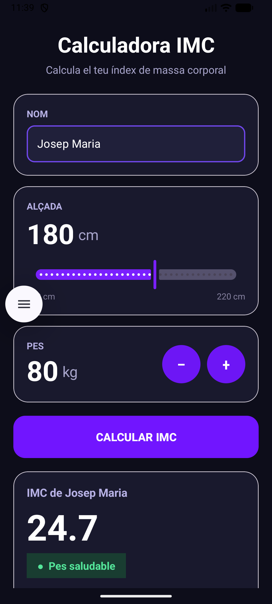

# BMI Calculator XML

Primera pràctica d'Android amb **Kotlin** utilitzant una interfície creada amb **XML**.

L'objectiu principal del projecte és començar a entendre el funcionament bàsic d'una aplicació Android utilitzant el sistema tradicional de vistes, abans de treballar amb tecnologies més modernes com **Jetpack Compose**.

En aquesta pràctica es construeix una calculadora d'IMC (Índex de Massa Corporal) senzilla, on l'usuari pot introduir el seu nom, seleccionar l'alçada, modificar el pes i calcular el seu IMC.

---

## Objectius de la pràctica

Amb aquest projecte es treballen els conceptes bàsics d'una aplicació Android:

- Crear una interfície amb **XML**
- Utilitzar diferents tipus de components visuals
- Accedir als components de la vista des de Kotlin
- Detectar accions de l'usuari
- Modificar el contingut de la interfície des del codi
- Fer càlculs senzills
- Aplicar condicions amb `if` i `when`
- Validar dades introduïdes per l'usuari
- Mostrar o ocultar components

